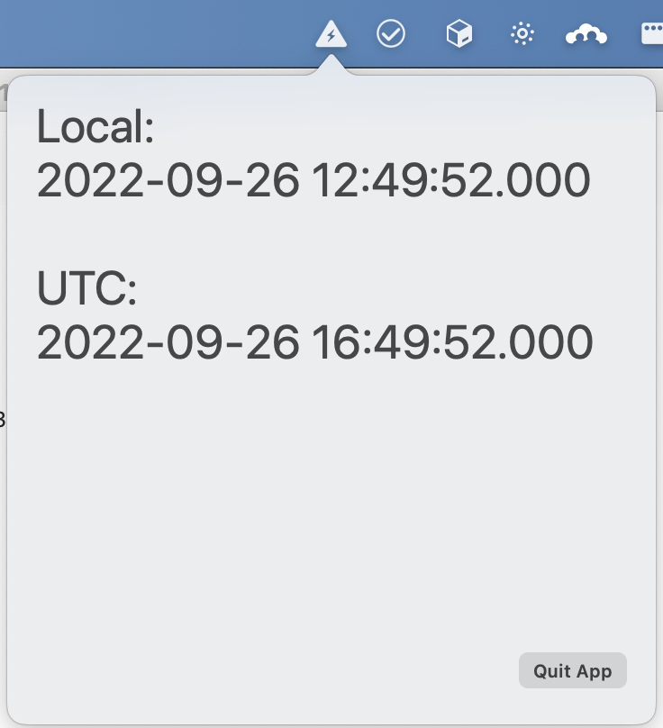

# Epoch Time

There are times where you hava a unix timestamp or the milliseconds equivalent, and you need to convert that quickly to a human readable data/time.

This app lives in the menu bar and all you have to do is to copy the timestamp to clipboard and click the menu item.

